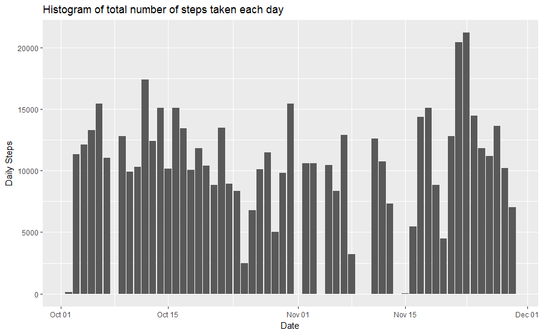
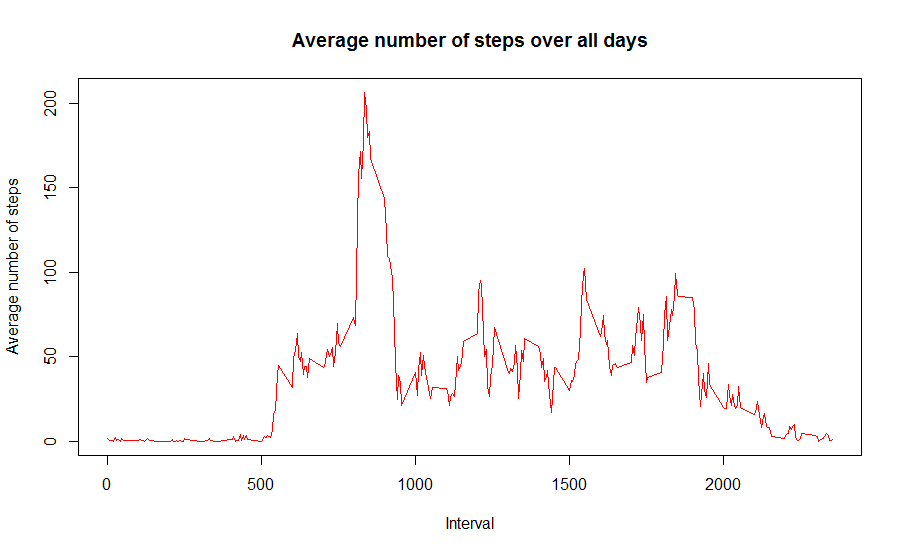
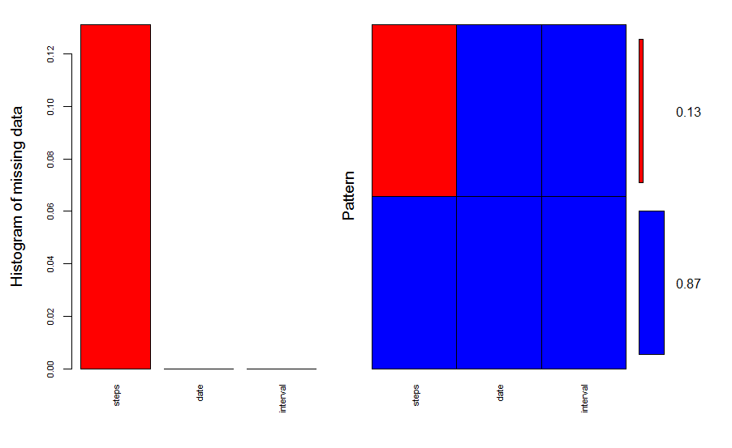
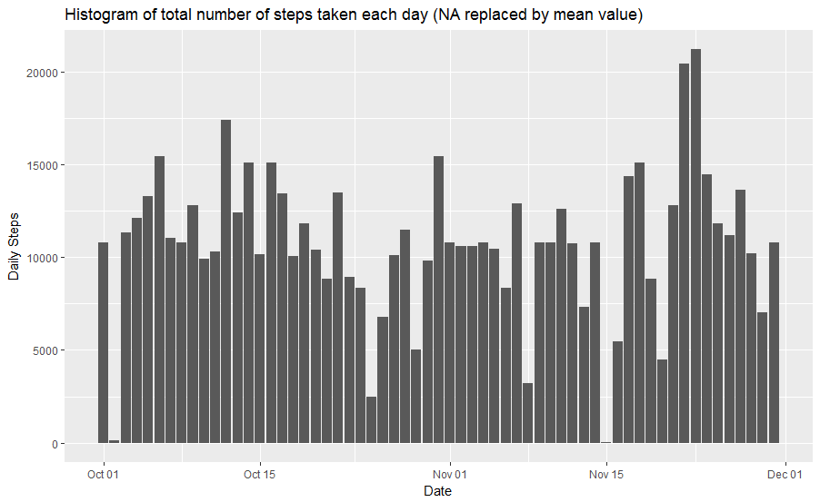
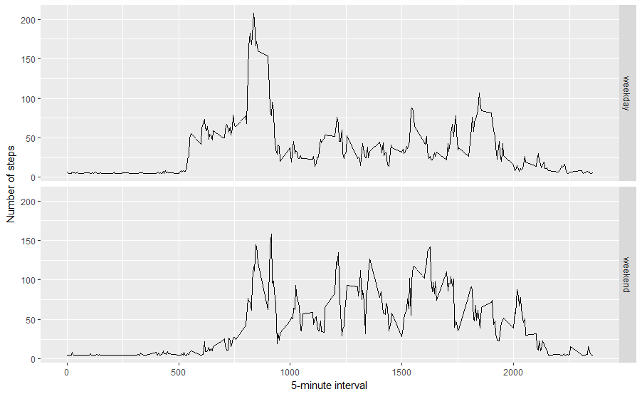

------------------------------
* title: "Reproducible Research: Peer Assessment 1"
* author: "Sergii Lysenko"
* date: "December 14, 2016"
* output: html_document

------------------------------

## Loading and preprocessing the data

The raw data is pre-processed to allow easy analysis and address questions about the data.

```{r}
library(dplyr)
#Read data from Dataset: Activity monitoring data
adata <- read.csv("./activity.csv")
# # Convert date variable from factor to date, and remove NAs
adata1<- na.omit(adata)
adata1$date <- as.Date(adata1$date)
# Group data by date, and summarize the sum of steps
adata_byday <- group_by(adata1, date)
steps_by_day <- summarise(adata_byday, total = sum(steps))
```

## What is mean total number of steps taken per day?

```{r}
library(ggplot2)
#=================================
## 2.Histogram of the total number of steps taken each day
#=================================

ggplot(steps_by_day,aes(x=date,y=total),type = "l")+geom_bar(stat="identity") + ylab("Daily Steps") + xlab("Date") + ggtitle("Histogram of total number of steps taken each day")

```
 

## What is the average daily activity pattern?

```{r}
#=================================
## 3. Mean and median number of steps taken each day
#=================================
meansteps <- mean(steps_by_day$total)
mediansteps <- median(steps_by_day$total)

print (meansteps)
```
[1] 10766.19
```{r}
print (mediansteps)
```
[1] 10765

```{r}
#=================================
## 4. Time series plot of the average number of steps taken
#=================================

avgadata1 <- aggregate(steps ~ interval, adata, mean)
# create a time series plot 
plot(avgadata1$interval, avgadata1$steps, type='l',col=2, 
     main="Average number of steps over all days", xlab="Interval", 
     ylab="Average number of steps")


```
 

```{r}
#=================================
## 5.The 5-minute interval that, on average, contains the maximum number of steps 
#=================================

max_row<-which.max(avgadata1$steps)
print (avgadata1 [max_row,])

```
№104  interval = 835    steps = 206.1698

## Imputing missing values
```{r}
#=================================
## 6.Code to describe and show a strategy for imputing missing data 
#=================================


#Visual representation can be obtained using the VIM package as follows

library(VIM)

aggr_plot <- aggr(adata, col=c('blue','red'), numbers=TRUE, sortVars=TRUE, labels=names(adata), cex.axis=.7, gap=3, ylab=c("Histogram of missing data","Pattern"))
```
 

```{r}
# Find the NA positions
na1 <- which(is.na(adata$steps))

# Create a vector of means
mean_vec <- rep(mean(adata$steps, na.rm=TRUE), times=length(na1))
# Replace the NAs by the means
adata[na1, "steps"] <- mean_vec

# Compute the total number of steps each day (NA values removed)
sum_data <- aggregate(adata$steps, by=list(adata$date), sum)
#=================================
## 7.Histogram of the total number of steps taken each day after missing values are imputed
#=================================

# Rename the attributes and create histogram
names(sum_data) <- c("date", "total")
sum_data$date <- as.Date(sum_data$date)
ggplot(sum_data,aes(x=date,y=total))+geom_bar(stat="identity") + ylab("Daily Steps") + xlab("Date") + ggtitle("Histogram of total number of steps taken each day (NA replaced by mean value)")
```

 

The sum_data data frame can be used to calculate the mean and median number of steps per day as follows:
```{r}
mean(sum_data$total)
```
[1] 10766.19
```{r}
median(sum_data$total)
```
[1] 10766.19

```{r}
#Mean and median values are higher after imputing missing data. The reason is that in the original data, there are some days with steps values NA for any interval
```


## Are there differences in activity patterns between weekdays and weekends?
```{r}

#=================================
## 8.Histogram of the total number of steps taken each day after missing values are imputed
#=================================
weekday.or.weekend <- function(date) {
        day <- weekdays(date)
        if (day %in% c("Monday", "Tuesday", "Wednesday", "Thursday", "Friday")) 
                return("weekday") else if (day %in% c("Saturday", "Sunday")) 
                        return("weekend") else stop("invalid date")
}
adata$date <- as.Date(adata$date)
adata$day <- sapply(adata$date, FUN = weekday.or.weekend)

#Create plot containing plots of average number of steps taken on weekdays and weekends.
averages <- aggregate(steps ~ interval + day, data = adata, mean)
ggplot(averages, aes(interval, steps)) + geom_line() + facet_grid(day ~ .) + 
        xlab("5-minute interval") + ylab("Number of steps")

```
 
